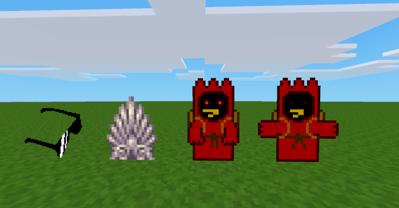

# skilleroatsje
A gallery mod for Minetest. This mod uses some code from the [gemalde mod by CasimirKaPazi](https://github.com/CasimirKaPazi/gemalde).
I've added some protection. You can now modify an image only with a right click if you are the owner of the image.

Why is the mod called Skilleroatsje? The term Skilleroatsje comes from the language [Sater Frisian](https://en.wikipedia.org/wiki/Saterland_Frisians) [(saterfriesisch)](https://de.wikipedia.org/wiki/Saterfriesen). It is spoken in my old hometown and means something like painting.

Licenses:
- Source: [GPL V3 or later](LICENSE)
- Pictures: [See textures/LICENSE_PICTURES](textures/LICENSE_PICTURES)
